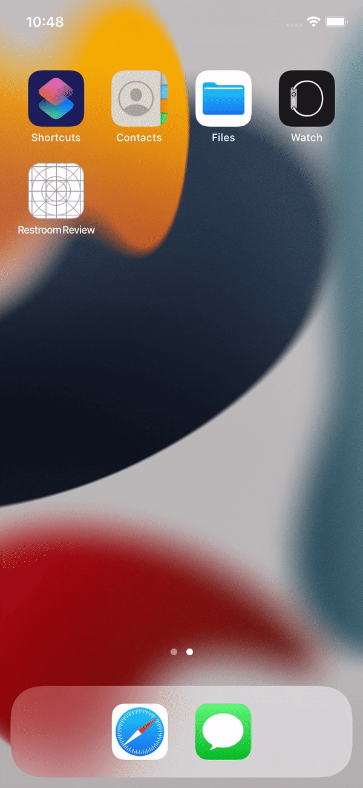
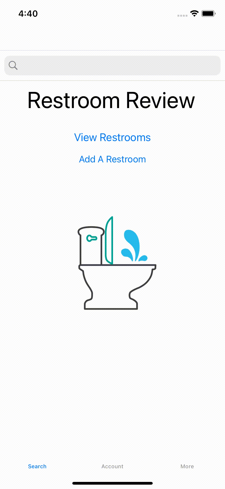

# Restroom Review
SFSU CSC660 Mobile Development Project

## Table of Contents
- [What is Restroom Review?](#what-is-restroom-review)
- [How does it work?](#how-does-it-work)
  - [Logging in](#logging-in)
  - [Creating Restrooms](#creating-restrooms)
  - [Finding Restrooms](#finding-restrooms)
  - [Restrooms](#restrooms)
  - [Creating Reviews](#creating-reviews)

## What is Restroom Review?
Restroom Review is an iOS app designed to help people find and review restrooms.

    Users can login via email to have the ability to leave a review on a restroom
    Users can create new restrooms if it doesn't exist already
    Users can create a review on a restroom for others to see
    Users can find restrooms around them or at a specific location

  

## How does it work?
<h3 align="center">Logging in</h3>
Users are able to login via email. Once logged in, users are able to see their profile under the account tab which shows the user's reviews.

  

<h3 align="center">Creating Restrooms</h3>
Users do not need an account to create a restroom. Users only need to have the restroom address, name, and an optional phone number.

<h3 align="center">Finding Restrooms</h3>
Users can simply click the `View Restrooms` button in the search tab to view restrooms near the users' location. This brings up the main screen users use to find restrooms. This screen shows a map of the nearby restrooms at the location with a button to show the list of the restrooms modally. Users are also able to move around the map to search new areas for restrooms.

Within this screen, users can also utilize the search bar here to view restrooms at a specific address. This same search bar also exists in the main search bar tab or home screen with the same functionality to view restrooms at a specific address.

<h3 align="center">Restrooms</h3>
Users can view specific restrooms by tapping on the restroom under that restroom list modal. This brings up a new screen which shows the restroom's name, address, phone number (if it has one), and reviews along with the option to add a review.

<h3 align="center">Creating Reviews</h3>
Users can create reviews by simply clicking the `Add a review` button under the restroom they want to review. This brings up a modal which gives the user the ability to rate the restroom on a 5 toilet paper scale and write whatever comments they have on the restroom.

Built using Swift and Firebase
